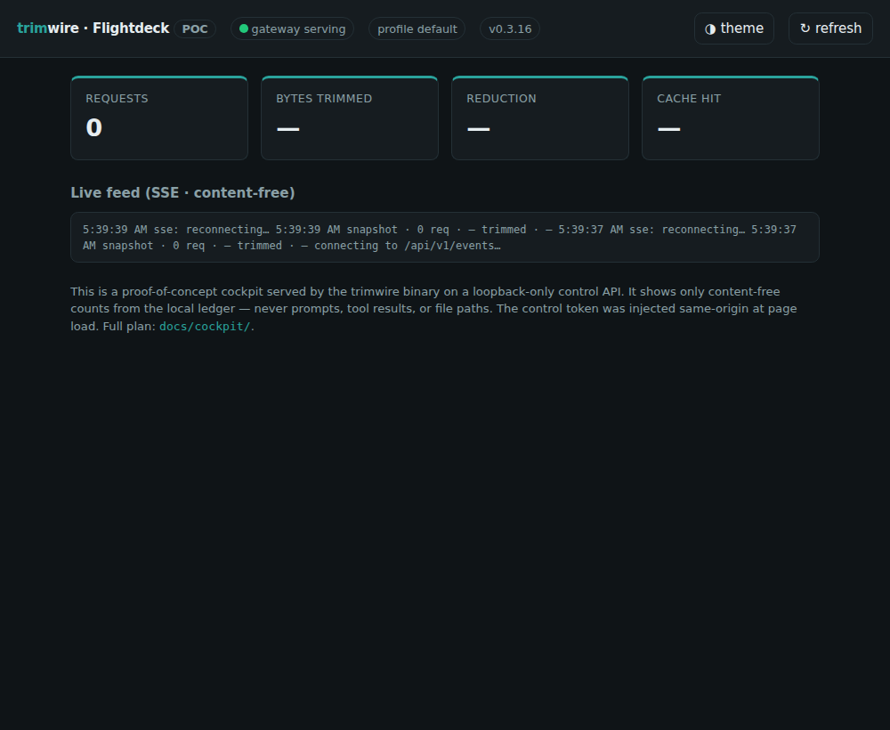

# 09 — Proof of Concept (small, but touches every layer)

> A deliberately small but **end-to-end vertical slice** of the cockpit, built on
> this branch. It compiles clean (`fmt` / `clippy -D warnings` / full test suite)
> and runs. It is **off by default** — the daemon is byte-for-byte unchanged unless
> you opt in via `[admin] enabled = true` or run `trimwire cockpit`.



*The running cockpit: teal Flightdeck brand, a live "gateway serving" indicator,
content-free KPI cards from the local ledger, and a working SSE feed — served by
the trimwire binary on a loopback-only control API.*

## What the POC includes (every layer, minimally)

| Layer (plan doc) | POC artifact | State |
|---|---|---|
| **Control API** (doc 03) | `src/admin/mod.rs` — separate **loopback admin listener** (`127.0.0.1:8766`), kept off the token-bearing gateway port | real |
| ↳ Auth seam (doc 06 R1) | `Authenticator` trait + `LoopbackToken` impl; 256-bit bearer token at `~/.trimwire/control.token` (`0600`), constant-time compare | real |
| ↳ DNS-rebind / CSRF guard (doc 03 §5, doc 06 R7) | authority (`Host`/h2 `:authority`) allowlist + same-origin `Origin` + `Sec-Fetch-Site` — three gates, ordered before auth | real |
| ↳ Token-page XSS hardening (doc 10 G3) | per-render **nonce CSP** (no `'unsafe-inline'`, `worker-src 'none'`) + `X-Frame-Options: DENY` on the token-bearing HTML | real |
| ↳ Read endpoints | `GET /api/v1/{health,version,service,stats}` — `stats` reuses the content-free ledger `Report`; `version` omits `upstream` | real |
| ↳ Live events (doc 03 §4) | `GET /api/v1/events` — SSE, content-free aggregate snapshot | real (one-shot; prod uses a broadcast channel) |
| **Web cockpit** (doc 04) | `src/admin/cockpit.html` — embedded single-file UI, teal design tokens, same-origin token bootstrap, KPIs + SSE log | real (vanilla; prod may use Svelte) |
| ↳ **PWA install** (doc 05 — PWA-first) | served `GET /manifest.webmanifest` + `GET /icon.svg`, linked from the HTML → **installable** ("Install app" / Add-to-Home-Screen, no store) | real (manifest+icon; service worker is a follow-up) |
| ↳ CLI surface | `trimwire cockpit` subcommand + `[admin]` config section | real |
| **Multi-platform app** (doc 05) | **PWA-primary** (the page above is the app on every platform) + `app/` Tauri 2 desktop-shell scaffold | PWA real; Tauri scaffold (not in CI) |
| **Remote** (doc 06) | non-loopback bind **refused** at startup; auth/identity seam present | seam only (deferred, by design) |
| **Security red lines** (doc 07) | loopback-only, token never exposed, `upstream` never written **nor returned**, content-free responses, separate module (not in `gateway.rs`) | enforced |

## Run it

```bash
# Easiest: one command starts the gateway + the control API + the web UI.
trimwire cockpit
#   [cockpit] open  http://127.0.0.1:8766  in your browser

# Or enable it permanently for the always-on daemon:
#   ~/.config/trimwire.toml
#   [admin]
#   enabled = true
#   listen  = "127.0.0.1:8766"
```

The control token is printed/located at `~/.trimwire/control.token`. The browser UI
is handed it same-origin at page load; CLI/curl callers pass
`Authorization: Bearer <token>`.

## Verified behaviour (smoke test)

```
GET /api/v1/health                         → 200 {"ok":true,"version":"0.3.16"}        (unauth)
GET /api/v1/stats        (no token)        → 401 unauthorized
GET /api/v1/stats        (Bearer token)    → 200 full content-free ledger Report
GET /api/v1/version      (Bearer token)    → 200 {version, control_api, profile, listen addrs}
                                              (NO `upstream` — credential routing never crosses the wire)
GET /api/v1/service      (Bearer token)    → 200 {serving:true, ...}   (live gateway probe)
GET /api/v1/health       (Host: evil.com)  → 403 forbidden: bad Host   (DNS-rebind guard)
GET /api/v1/health       (Origin: evil)    → 403 forbidden: bad Origin (cross-origin guard)
GET /                                       → HTML, token injected, nonce-CSP (no `'unsafe-inline'`)
```

Plus 13 unit tests in `src/admin/mod.rs` (constant-time compare, authority/Origin/
`Sec-Fetch-Site` guards, bearer extraction, token generation = 256-bit hex + stable +
concurrency-safe, authenticator accept/reject, `/version` contract incl. **`upstream`
absent**, `/stats` content-free, PWA manifest, nonce-CSP, HTML-placeholder guard) and a
`[admin]`-global-only regression test in `src/config.rs`. Full suite stays green:
`cargo fmt --check`, `cargo clippy --all-targets -- -D warnings`, `cargo test --all-features`.

## What is deliberately NOT in the POC

- No config **write** / hot-reload (read + control-shape only); no `ArcSwap` refactor.
- No socket-activation for the admin port (plain loopback bind).
- No real streaming SSE (one-shot snapshot; `EventSource` reconnects make it live-ish — and
  each reconnect re-runs a ledger `report()` query, so an open tab polls ~every 2s. Production
  replaces this with a broadcast channel fed at ledger-write time, doc 03 §4).
- No custom **`X-Trimwire-Control`** preflight-forcing header — not needed yet (the POC is
  read-only + token-gated), but **required before any mutating endpoint** (`POST /service/*`,
  `PUT /config`) lands, per doc 10 G1.
- No remote transport, pairing, or `devices` table (deferred phase — only the seams).
- The Tauri `app/` is a scaffold: it shows the shape but is not built by CI and needs
  the Tauri toolchain to run.

These are the exact follow-ups itemized in docs 03/06/08 — the POC is the first
slice of that plan, not a shortcut around it.

## New dependencies

**None.** The control API reuses `hyper` / `http-body-util` / `tokio` / `serde_json`
/ `getrandom` / `hex` already in the dependency tree — honoring the single-static-
binary, no-heavy-runtime-deps ethos.
